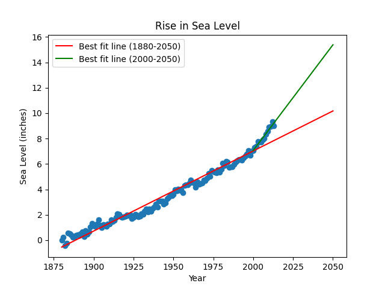

# Sea Level Predictor
freeCodeCamp_Data Analysis with Python_Project 

Tools: Python, Pandas, Matplotlib

Summary: Analyzed historic sea level data to predict future changes in global sea levels through linear regression.

Analysis:
- Visualized global sea level change since 1880
- Performed linear regression to model future sea level rise through 2050
- Communicated uncertainty using two regression lines (historic and recent trends)

Key Skills: Time series analysis, linear regression, data visualization, predictive modeling

